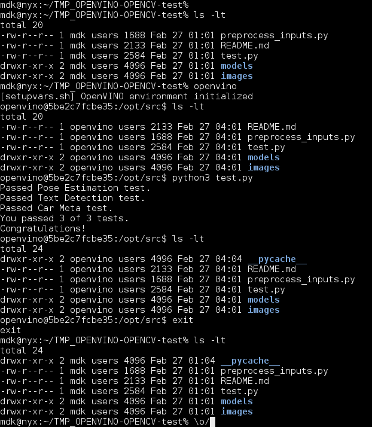

# OpenVINO + OpenCV
This folder contains an OpenVINO installation (based on the [official documentation](https://docs.openvinotoolkit.org/latest/_docs_install_guides_installing_openvino_docker_linux.html)), and a OpenCV variant (python bindings)

**NOTE**: This will install only the CPU runtime for the Inference Engine.

## Building:
- openvino:
    ```
    $ ./build.sh
    ```

- openvino-opencv:
    Build `openvino` and then:
    ```
    $ ./build-opencv.sh
    ```

## Running:
- openvino:
    ```
    $ ./run.sh
    ```
    This will put you on the container command line, inside OpenVINO's installation directory.

- openvino-opencv:
    ```
    $ ./run-opencv.sh
    ```
    The issued command will put you inside the container, on the `/opt/src` directory, that is a bind-mount volume from the current host directory, and set *userid*/*groupid* to match the host current user too.

    This allow you to develop your code on your machine and use the container to run the actual code; any output generated you be available on your current directory as well.

    A use case is to put `run-opencv.sh` on your *PATH* environment variable and call it fom anywhere on your system, like this (here `~/.bin` is already on my `$PATH`):
    ```
    host $ cd ~/.bin
    host $ ln -s /PATH/TO/THIS/DOCKERFILE/run-opencv.sh openvino
    host $ cd /PATH/TO/YOUR/PROJECT
    host $ openvino
    container:/opt/src $
    ```

### Example:


## Notes:
Will update this dockerfile according my use, so stay tuned ;)

Also, feel free to make suggestions and report any issue found :)
